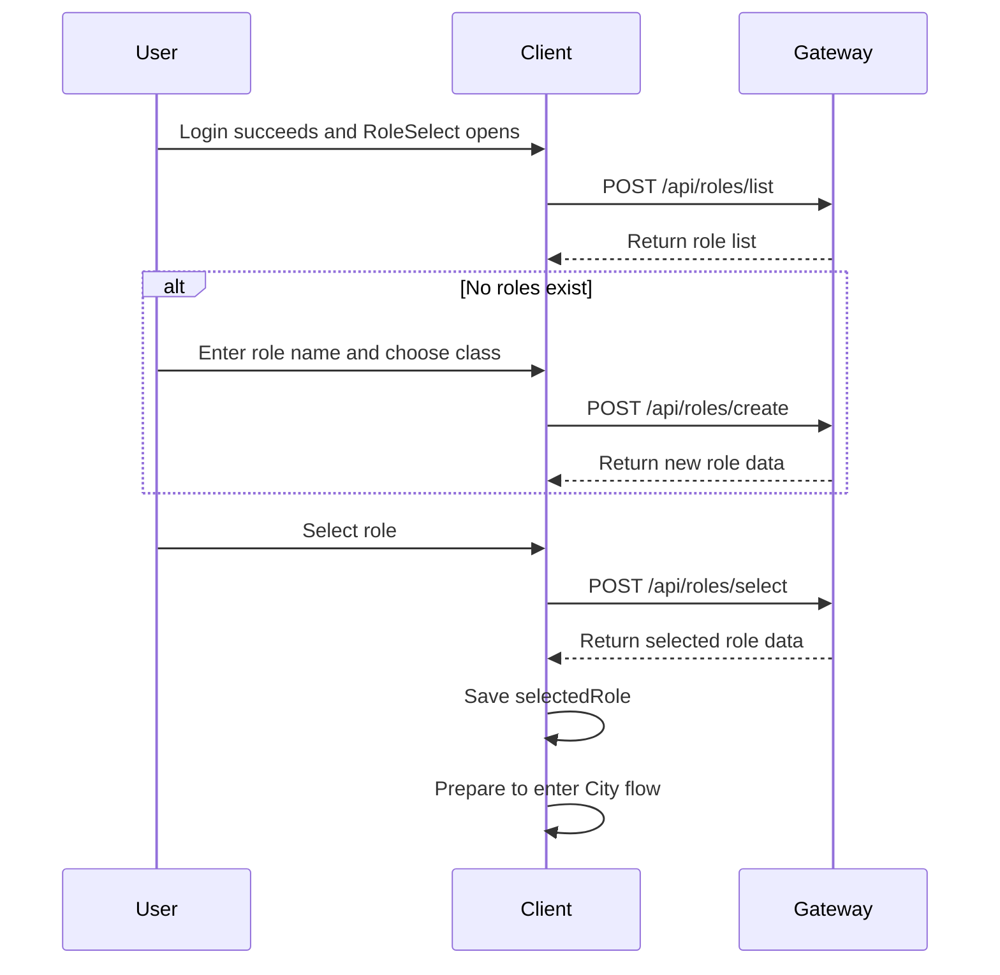

# Role Selection Sequence

This document describes the Phase 1 role selection flow. It is design-only and does not implement server or client business code.

## Flow Diagram

## Detailed Steps

1. The Unity client enters RoleSelect after a successful login response.
2. The client sends role list intent with `POST /api/roles/list`.
3. The Gateway returns a role list owned by the server.
4. If no role exists, the client lets the user enter a role name and choose a class.
5. The client sends create-role intent with `POST /api/roles/create`.
6. The Gateway returns the created role data.
7. The user selects a role.
8. The client sends select-role intent with `POST /api/roles/select`.
9. The Gateway returns selected role data.
10. The client stores `selectedRole` and prepares to enter City flow.

## Protocol Messages

- `C2S_GetRoleListReq`
- `S2C_GetRoleListRes`
- `C2S_CreateRoleReq`
- `S2C_CreateRoleRes`
- `C2S_SelectRoleReq`
- `S2C_SelectRoleRes`

## Client UI States

- Loading role list.
- Empty role list.
- Create role input.
- Role list ready.
- Selecting role.
- Error and retry.
- Selected role saved.

## Phase Boundary

After role selection succeeds, the client only saves selected role information and prepares to enter City flow. The actual empty city entry is designed in Phase 1 Task 5.

Real scene loading, WebSocket, entity sync, movement sync, combat, inventory, quest, chat, database, and Redis are not part of this task.

