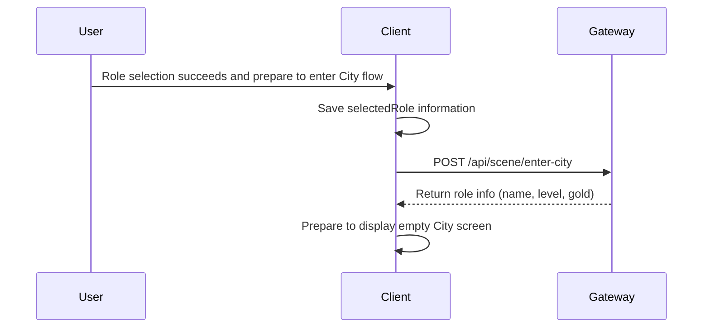

# City Entry Sequence

This document describes the Phase 1 empty city screen entry flow. It is design-only and does not implement server or client business code.

## Flow Diagram



## Detailed Steps

1. The Unity client completes role selection successfully and prepares to enter the City flow.
2. The client saves the selected role information locally.
3. The client sends enter-city intent with `POST /api/scene/enter-city`.
4. The Gateway returns minimal role information (name, level, gold) for display.
5. The client prepares to display the empty City screen with basic role data.

## Client Steps

- After role selection succeeds, save the selected role information.
- Send enter-city request to the server via HTTP API.
- Receive role information from server response.
- Prepare to display the empty City screen with role name, level, and gold.
- Do not implement real scene loading, entity sync, movement sync, combat, inventory, quest, or chat.

## Service Steps

- Validate the player token and selected role ownership.
- Return minimal role information (name, level, gold) for display.
- Do not implement real scene loading, entity sync, movement sync, combat, inventory, quest, or chat.
- Maintain authority over role data and game state.

## Failure Flow

If the enter-city request fails:

- The server returns an error code and message.
- The client displays an error message and allows retry.
- Common failure reasons: invalid token, role not found, server error.

## Phase 1 Minimum Closed Loop

After Phase 1 Task 5, the minimum closed loop is complete:

```text
Login
-> Role selection
-> Empty city screen
```

The client can now run the full flow from login to displaying an empty city screen with basic role information.

## Protocol Messages

The communication uses the following protocol messages defined in `proto/scene.proto`:

- `C2S_EnterCityReq`
- `S2C_EnterCityRes`
- `CityRoleInfo`

## Client UI States

- Preparing to enter City flow.
- Loading city data.
- Displaying empty City screen with role information.
- Error and retry.

## Implementation Note

This is a design document only. No server business code or real Unity UI implementation is included in Phase 1 Task 5. The empty city screen displays only role name, level, and gold. Real scene loading, entity sync, movement sync, combat, inventory, quest, and chat are not implemented in this task.
