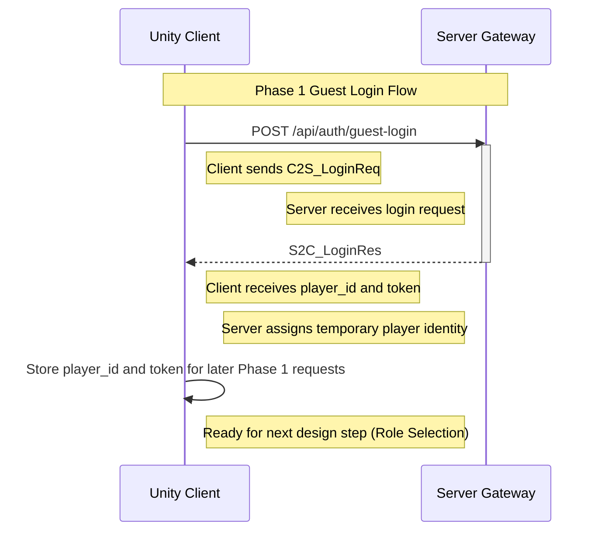

# Login Sequence Diagram

This document describes the sequence of operations during the login process in the MMORPG Demo Phase 1.

## Login Flow

The following diagram shows the interaction between the client and server during the login process:

## Detailed Steps

1. **Client Initiation**: The Unity client prepares a login request containing device ID, platform, and app version.

2. **Request Transmission**: The client sends an HTTP POST request to `/api/auth/guest-login` with the login data.

3. **Server Processing**: The server receives the request and processes the login attempt.

4. **Identity Assignment**: The server assigns a temporary player ID and generates an authentication token.

5. **Response Transmission**: The server sends back a response containing the player ID, token, and server time.

6. **Client Storage**: The client stores the received player ID and token for future requests.

7. **Next Flow**: The client is ready to request role selection data in a later task. No WebSocket connection is designed or implemented in Task 3.

## Protocol Messages

The communication uses the following protocol messages defined in `proto/auth.proto`:

- `C2S_LoginReq`: Client-to-server login request
- `S2C_LoginRes`: Server-to-client login response

## Error Handling

If the login request fails, the server will return an error code and message in the `S2C_LoginRes`:

- `code`: Non-zero value indicating the type of error
- `message`: Human-readable description of the error
- Other fields will be empty or default values

## Phase 1 Limitations

- This is a guest login system with no account verification
- Tokens are for demonstration purposes only
- No database persistence in Phase 1
- No complex authentication logic
- No WebSocket, database, Redis, or JWT implementation in this task
